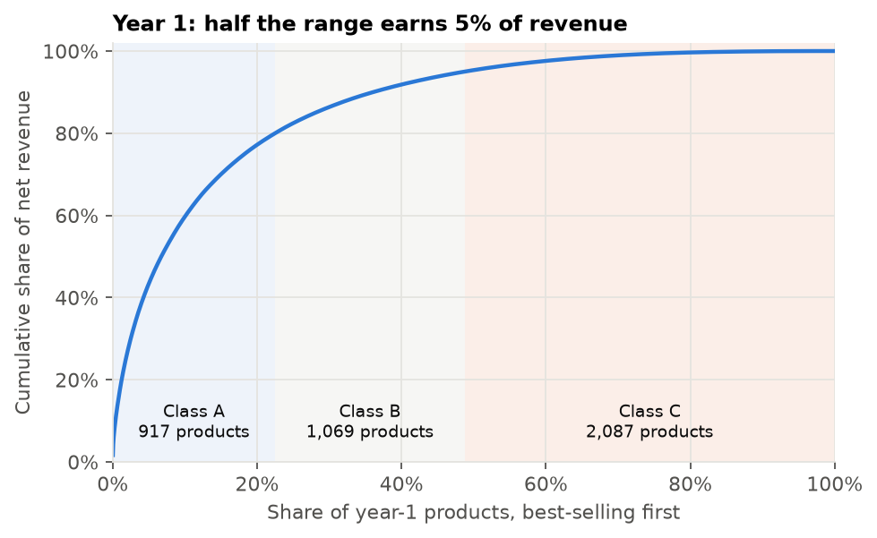
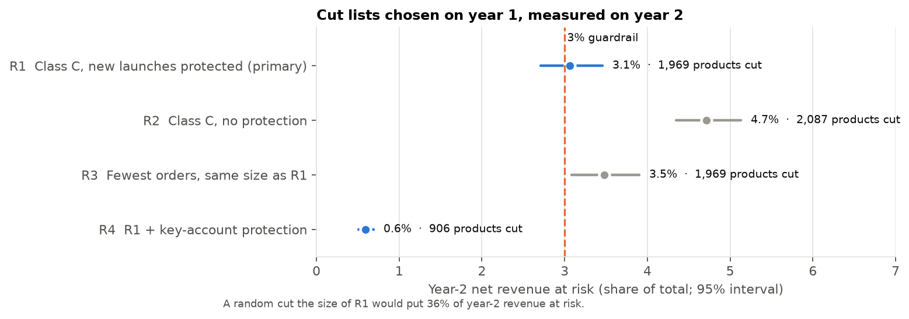
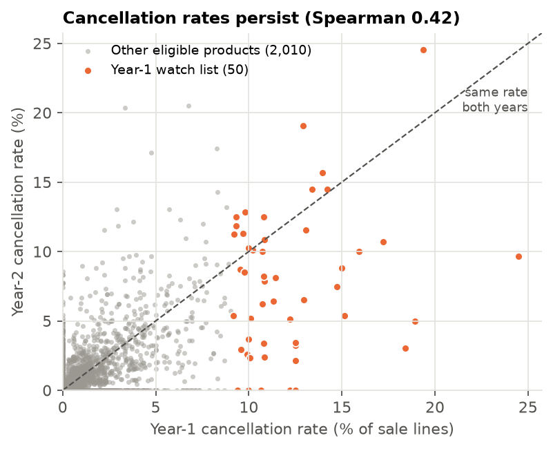
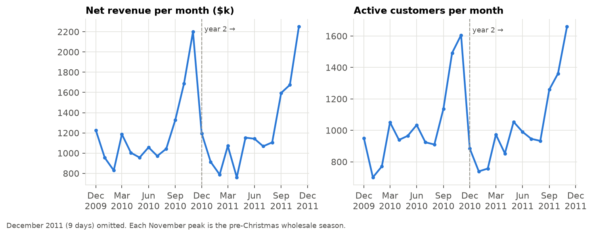

# Retail operations case study: which products to discontinue, tested on the following year

[](https://github.com/Andresperez397/retail-operations-case-study/actions/workflows/ci.yml)

An online retailer sells about 4,000 products, and half of them bring in 5% of revenue. Which ones should the merchandising team discontinue, and how much revenue would that put at risk? The case study covers the work an operations or business analyst does end to end:
- SQL staging of messy invoice data
- written KPI definitions
- a dashboard
- a one-page recommendation for a decision-maker.

Every candidate rule was chosen on one year of data and tested on the next.

**Live dashboard:** [retail-operations-dashboard.streamlit.app](https://retail-operations-dashboard.streamlit.app) · **Decision memo:** [one page, PDF](reports/Range%20Review%20Memo.pdf)

**Data:** UCI Online Retail II, every invoice line of a UK online giftware retailer, December 2009 to December 2011 (1,067,371 raw lines; CC BY 4.0). Amounts are in US dollars, converted from the source's British pounds at a fixed $1.5774 per £1 (the Federal Reserve's average rate over the period).
**Stack:** SQL (DuckDB), Python (pandas, NumPy), Streamlit, pytest, GitHub Actions.

## Recommendation

| Recommendation | Evidence |
|---|---|
| **1. Discontinue 906 products** (22% of the range): low-revenue products that fewer than three key accounts buy | Tested on the following year, they put **0.6% of revenue at risk** ($87k of $14.72M; 95% CI 0.5–0.7%). |
| **2. Do not cut the standard "class C" tail** (1,969 products) | It puts 3.1% at risk (2.7–3.5%), over the 3% guardrail set in advance, and touches 60% of customers. |
| **3. Send the 50 products with the highest cancellation rates for a listing review each year** | Next year they cancel at **4.6× the rate** of other products (95% CI 3.6–5.8×). |

## Findings

**1. Half the range earns 5% of revenue, but that tail is not safe to cut on revenue alone.**
The primary rule cuts the year-1 class C tail (bottom 5% of revenue), sparing products launched in the last quarter. It failed its pre-specified test by a small margin: 3.06% of year-2 revenue at risk against a 3% guardrail.



**2. The risk sits in products that key accounts buy; protecting them fixes the rule.**
81% of the class C tail's at-risk revenue was in products bought by at least three of the top 10% of customers. Several of those products grew sharply the next year. The pre-specified variant that spares them cuts 906 products at 0.6% risk.

| Rule (chosen on year 1) | Products cut | Year-2 revenue at risk (95% CI) | Picks removed | Became year-2 A/B sellers |
|---|---|---|---|---|
| R1 Class C, new launches protected (primary) | 1,969 | 3.1% (2.7–3.5) | 7.9% | 62 |
| R2 Class C, no protection | 2,087 | 4.7% (4.3–5.2) | 10.2% | 123 |
| R3 Fewest orders, same size as R1 | 1,969 | 3.5% (3.1–3.9) | 6.3% | 74 |
| **R4 R1 + key-account protection** | **906** | **0.6% (0.5–0.7)** | 1.4% | 10 |
| Random cut, same size as R1 | 1,969 | 36% | | |

- **Protection for new products is needed.** Without it, false cuts double: 123 against 62.
- **A revenue rule beats an order-count rule at equal size,** by 0.4 points (95% CI 0.2–0.6).
- **Sensitivity checks:** keeping duplicate lines, or moving the new-launch cutoff by a month, leaves R1 between 3.0% and 3.2%. A wider tail (the bottom 10% of revenue instead of 5%) puts 5.5% at risk.



**3. Cancellation problems persist, so a watch list is worth running.**
Among 2,060 products with at least 20 sale lines in each year, cancellation rates correlate from year 1 to year 2 (Spearman 0.42, 95% CI 0.38–0.46). The year-1 top 50 fell from 12.6% to 7.1% in year 2. That still runs 4.6 times the 1.5% of other products: part of the gap persists and part regresses toward average.



**4. KPIs: year 2 grew 1.9%, with fewer, larger orders, and cancellations did not rise once one event is set aside.**

| | Year 1 | Year 2 |
|---|---|---|
| Net revenue | $14.44M | $14.72M |
| Orders | 19,743 | 18,957 |
| Average order value | $751 | $802 |
| Cancellation rate | 2.6% | 3.1% (2.4% without one order) |
| Products sold | 4,073 | 3,797 |

One order for 74,215 storage jars ($122k) was placed and cancelled within 16 minutes in January 2011. On its own it lifts year 2's cancellation rate from 2.4% to 3.1%, which is why the dashboard reports both figures. 92 lines carry implausible prices, such as $1,024.52 for a basket that normally sells at $9.39. They add 0.4% to year-2 revenue and do not touch any cut list (see DEVIATIONS.md).



## How it was done

1. **Audit first** ([DATA_AUDIT.md](DATA_AUDIT.md)). The two source sheets overlap by nine days: 22,523 identical rows that would double-count early December 2010. Other problems found:
   - 11,812 exact duplicate lines
   - cancellations mixed in with sales
   - postage, fees and manual adjustments under product codes
   - stock write-offs recorded as negative sales
   - lower-case duplicate product codes
   - 23% of lines without a customer ID.
2. **SQL staging** ([sql/01_staging.sql](sql/01_staging.sql)). Every raw row is kept with a status and a line type, so each exclusion can be counted and traced.
3. **KPI layer** ([sql/02_kpis.sql](sql/02_kpis.sql), [KPI_DEFINITIONS.md](KPI_DEFINITIONS.md)). One definition per KPI, used at both monthly and yearly grain.
4. **Pre-registered decision analysis** ([ANALYSIS_PLAN.md](ANALYSIS_PLAN.md), committed before any year-2 product result was computed). It fixes four cut rules, five outcome measures, a 3% guardrail, the bootstrap method and the sensitivity checks. Changes made after the freeze, and exploratory checks, are logged in [DEVIATIONS.md](DEVIATIONS.md).
5. **Out-of-time test.** Rules see only year 1 (December 2009 to November 2010); outcomes come from year 2 (December 2010 to November 2011). Intervals come from a cluster bootstrap over year-2 customers.
6. **Memo and dashboard.** The memo states the recommendation, the evidence and the limits on one page. The dashboard shows the KPIs, the cut lists (searchable and downloadable) and the cancellation watch list.

**Tests:** 11 tests run on a synthetic extract with every audited problem planted, plus hand-built tables for the decision logic. CI runs lint and the tests on every push. Runs are deterministic: the same input gives byte-identical tables.

## Limits

- **Revenue only.** The data has no cost, margin or stock levels, so the savings from a smaller range are not measured. A real sign-off would add margin and holding cost.
- **An upper bound.** Revenue at risk assumes no customer switches to a substitute product.
- **One transition tested,** from 2010 to 2011.
- **Selection.** R4 was one of four pre-specified rules and was chosen after seeing all four results. Its interval sits far below the guardrail.

## Run it

```bash
python -m venv .venv && .venv/bin/pip install -r requirements.txt
.venv/bin/python scripts/fetch_data.py                  # 45 MB from UCI; checks SHA-256
PYTHONPATH=src .venv/bin/python scripts/data_audit.py
PYTHONPATH=src .venv/bin/python scripts/run_analysis.py
PYTHONPATH=src .venv/bin/python scripts/make_figures.py
.venv/bin/python -m pytest -q
.venv/bin/pip install -r app/requirements.txt && .venv/bin/streamlit run app/streamlit_app.py
```

The dashboard reads only the committed tables in `reports/tables`, so it runs without the raw data.

**Data citation:** Chen, D. (2019). Online Retail II [Dataset]. UCI Machine Learning Repository. https://doi.org/10.24432/C5CG6D (CC BY 4.0).
